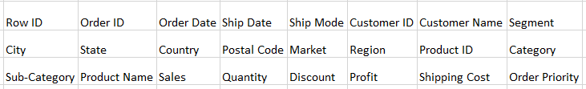
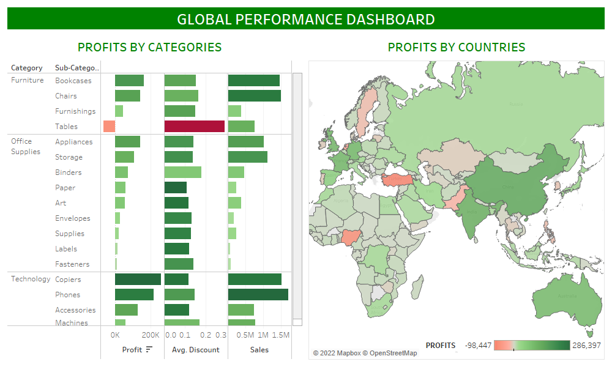

<h1 align="center">Global Superstore Performance Using Tableau</h1>
<h4 align="center">18-10-2022</h4> 

<h3>Business Task/ Goal</h3> 

The purpose of this analysis is to gain insights into:

<ol>
  <li>Superstore's profits/ loses worldwide in various countries;</li>
  <li>Inform decision making as a result of the findings.</li>
</ol>
<h3>Data Sources</h3> 

The Superstore dataset is online. Download the dataset <a href="https://github.com/shittuadams/WallmartDataAnalysis/blob/main/Walmart-Retail-Data.xlsx" target="_blank">here</a>.

   
The fields of the dataset are as follows:
 
   

    
  

<h3>Data Visualization Tool</h3>

Tableau was the visualization software used.
 

<h3>Data Visualization Process</h3>

The following steps were taken in Tableau:
 
<ol>
   <li>Profits, discounts and average sales of all product categories and sub-categories are compared in order to draw relationships.</li>
   <li>A map of all countries profits is created.</li>
   <li>The map is used as a filter.</li>
</ol>
<h3>Dashboard</h3>

    
   Click <a href="https://public.tableau.com/views/GlobalPerformanceDashboard_16661126684710/GlobalPer?:language=en-US&:display_count=n&:origin=viz_share_link">here</a> to view on Tableau Public.

<h3>Key Findings</h3> 

The following insights were discovered: 

<ol>
<li>Sales of tables in the furniture category is not profitable.</li>  
<li>Discounts for sales of tables for whatever reasons accounted for the loses from the sales of tables.</li> 
</ol>
<h3>Recommendations </h3>
<ol>
<li>Sales of tables should be discountinued in countries where loses are made which is caused by granting too much discounts, except their is a cogent reason for continuing the discounts.</li>  
</ol>

